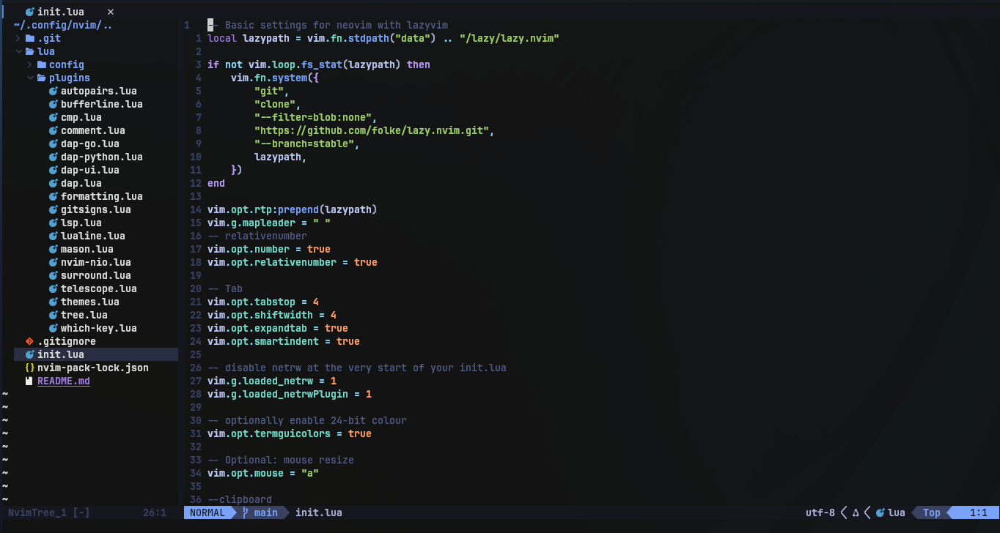

# 🚀 Neovim Development Environment Setup

This guide lists all external tools required for a full LSP-based development setup in Neovim. It covers C/C++, Python, Go, Rust, JavaScript ecosystem, Lua, Shell scripts, and search tools.

---

## 📦 Core Requirements

Install the basic system requirements for a functional Neovim setup:

```bash
# Arch Linux
sudo pacman -S neovim git base-devel curl wget unzip
```

*Note: The Plugin Manager (lazy.nvim) is auto-installed via config — no manual step needed.*

---

## 💻 Language Setups

### 🔵 C / C++
Requires `clangd` for LSP. Optional but recommended: `cmake`, `cppcheck`.

```bash
# Install LSP and formatter
sudo pacman -S clang
# Optional: IntelliSense improvements and build tools
sudo pacman -S cmake make
# Linter
sudo pacman -S cppcheck
```

**Project Setup (IMPORTANT):** Generate compile commands in your project root:
```bash
cmake -DCMAKE_EXPORT_COMPILE_COMMANDS=1 .
```

**Verification:**
```bash
clangd --version
```

### 🐍 Python
Requires `pyright` (LSP), `black` (Formatter), `ruff` (Linter). We recommend using `pipx`.

```bash
# Install pipx
sudo pacman -S python-pipx
pipx ensurepath

# Install tools
pipx install pyright black ruff
```

**Project Setup:** Always use a virtual environment!
```bash
python -m venv venv
source venv/bin/activate
```

**Verification:**
```bash
pyright --version
```

### 🐹 Go
Requires `gopls` (LSP) and `golint`. Go comes with `gofmt` built-in.

```bash
sudo pacman -S go
go install golang.org/x/tools/gopls@latest
go install golang.org/x/lint/golint@latest
```

Add to PATH if needed:
```bash
export PATH=$PATH:$(go env GOPATH)/bin
```

**Verification:**
```bash
gopls version
```

### 🦀 Rust
Requires `rust-analyzer`. Rust comes with `rustfmt` built-in.

```bash
curl https://sh.rustup.rs -sSf | sh
source ~/.bashrc
```

**Verification:**
```bash
rust-analyzer --version
```

### ⚛️ JavaScript / TypeScript / React / Next.js
Requires Node.js ecosystem tools.

```bash
# Install Node.js
sudo pacman -S nodejs npm

# Install LSP, Formatter, Linter
npm install -g typescript typescript-language-server
npm install -g prettier
npm install -g vscode-langservers-extracted

# Optional: Tailwind CSS Support
npm install -g @tailwindcss/language-server
```

**Create a Next.js Project:**
```bash
npx create-next-app@latest my-app
cd my-app
```

**Verification:**
```bash
typescript-language-server --version
prettier --version
```

### 🌙 Lua
Requires `lua-language-server`.

```bash
sudo pacman -S lua-language-server
```

### 🐚 Shell Scripts (.sh)
Requires `bash-language-server` (LSP), `shellcheck` (Linter), and `shfmt` (Formatter).

```bash
sudo pacman -S bash-language-server shellcheck shfmt
```

**Verification:**
```bash
bash-language-server --version
shellcheck --version
shfmt --version
```

---

## 🔍 Telescope Dependencies

Telescope requires `ripgrep` for fast project text search and `fd` for fast file finding.

```bash
sudo pacman -S ripgrep fd
```

**Verification:**
```bash
rg --version
fd --version
```

---


# Simple Neovim Formatting Setup

This setup uses only:

* LSP
* External formatter binaries

No extra formatting plugin is needed.

---

# Install Formatters

## JavaScript / TypeScript

```bash
sudo npm install -g prettier
```

---

## Go

```bash
go install golang.org/x/tools/cmd/goimports@latest
```

---

## Lua

```bash
cargo install stylua
```

---

## Python

```bash
pip install black
```

---

## C / C++

```bash
sudo pacman -S clang
```

---

## Shell

```bash
sudo pacman -S shfmt
```

---

## Rust

```bash
rustup component add rustfmt
```

---

# How To Format Code

Inside Neovim:

```vim
:lua vim.lsp.buf.format()
```

---

# Optional Keymap

Add this to your Neovim config:

```lua
vim.keymap.set("n", "<leader>f", vim.lsp.buf.format)
```

Usage:

```text
Space + f
```

(if leader key is space)

---

# Auto Format On Save

Add this:

```lua
vim.api.nvim_create_autocmd("BufWritePre", {
    callback = function()
        vim.lsp.buf.format()
    end,
})
```

Now files automatically format when saving.

---

# Supported Languages

| Language   | Formatter         |
| ---------- | ----------------- |
| Go         | goimports + gofmt |
| JavaScript | prettier          |
| TypeScript | prettier          |
| Lua        | stylua            |
| Python     | black             |
| Rust       | rustfmt           |
| C          | clang-format      |
| C++        | clang-format      |
| Shell      | shfmt             |

---

# Notes

* Install formatter binaries once.
* LSP handles formatting.
* Save file to auto-format.
* Use `Space + f` for manual formatting.


## 🧠 General Notes & Health Checks

* Avoid using `pip install` globally (breaks system on Arch).
* Prefer `pipx` or language-specific installers.
* Always verify binaries are in PATH.
* Prettier is only for JS/TS/React/HTML/CSS; works best inside Node projects with `package.json`.

**Neovim Health Check:**
Inside Neovim, run:
```vim
:checkhealth lsp
```
# Neovim Debugging Setup (Python & Go)

## Python

### Required Installation

Install Python debugger:

```bash
sudo pacman -S  python-debugpy
```

Verify installation:

```bash
python -m debugpy --version
```
---

## Go

### Required Installation

Install Delve:

```bash
go install github.com/go-delve/delve/cmd/dlv@latest
```

Verify installation:

```bash
dlv version
```
If `dlv` is not found, add:

```bash
export PATH="$PATH:$HOME/go/bin"
```

to your shell configuration.

---


